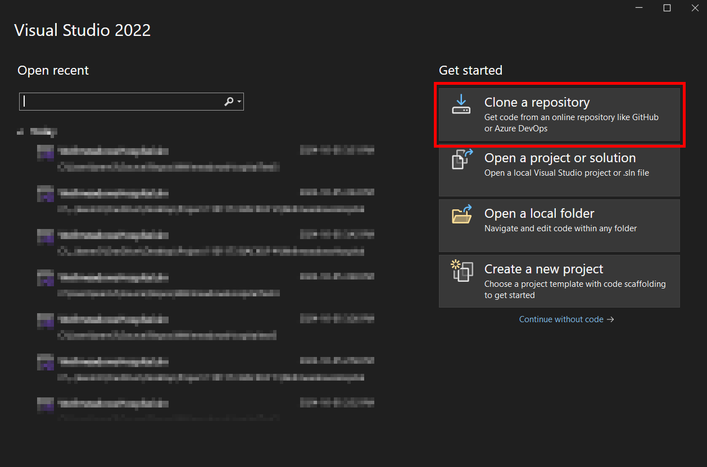
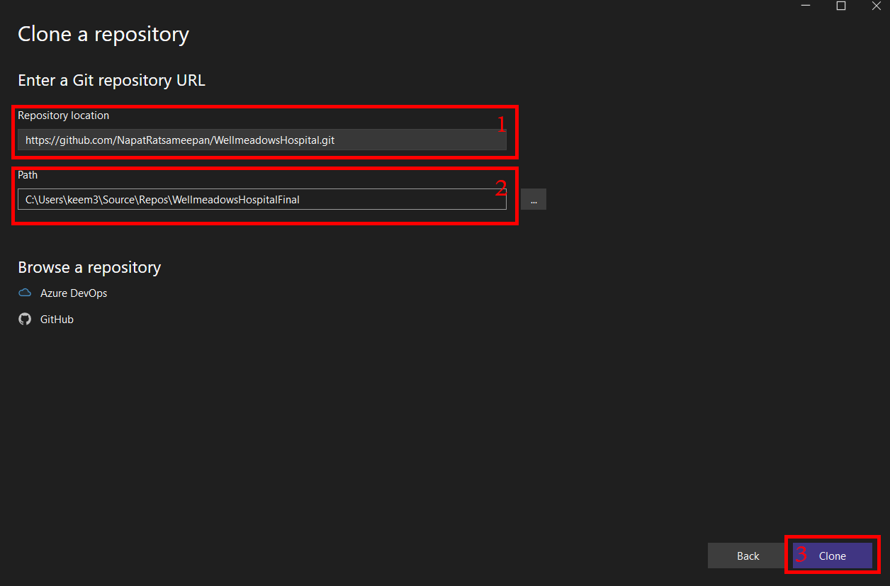
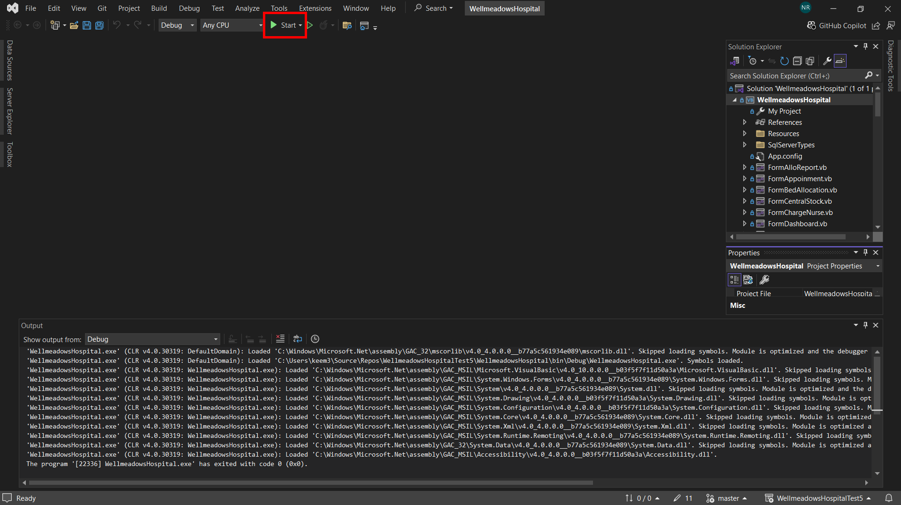
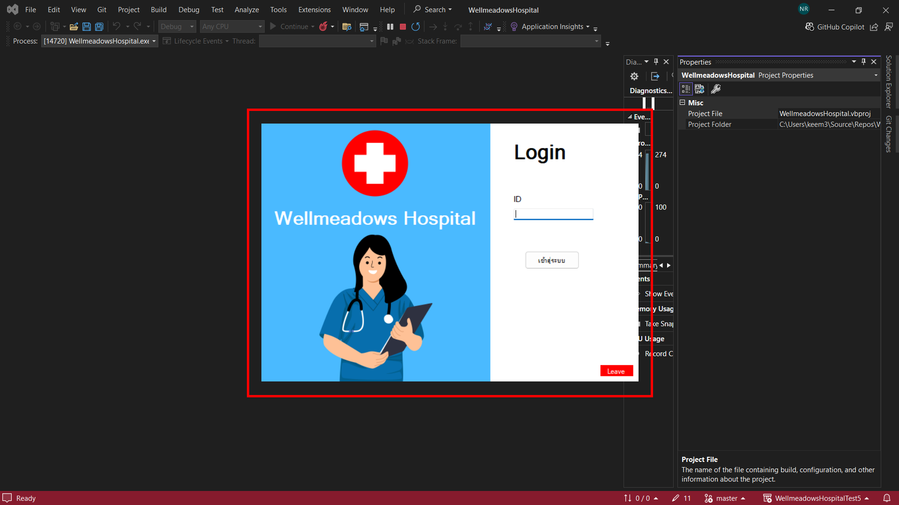

# 1101173 Project in Database Administration

## ระบบฐานข้อมูลโรงพยาบาลเวลมีโดว
ระบบฐานข้อมูลโรงพยาบาลเวลมีโดวเป็นระบบที่ออกแบบมาเพื่อจัดการข้อมูลที่สำคัญของโรงพยาบาล เช่น ข้อมูลผู้ป่วย ข้อมูลเจ้าหน้าที่ ยาและเวชภัณฑ์    
รวมถึงระบบเพื่อการรายงานและวิเคราะห์ข้อมูล ระบบนี้ช่วยให้เจ้าหน้าที่สามารถเข้าถึงและจัดการข้อมูลต่างๆ ได้อย่างมีประสิทธิภาพและเพิ่มความแม่นยำในการบันทึกข้อมูลและช่วยให้กระบวนการทำงานของโรงพยาบาลเป็นไปอย่างรวดเร็วมากยิ่งขึ้น

## เครื่องมือและเทคโนโลยีที่ใช้ในการพัฒนาระบบ
- [SQL Server Management Studio (SSMS)](https://docs.microsoft.com/en-us/sql/ssms/sql-server-management-studio-ssms)
- [Visual Basic](https://docs.microsoft.com/en-us/dotnet/visual-basic/)
- [Visual Studio](https://visualstudio.microsoft.com/)
- [.NET Framework](https://dotnet.microsoft.com/en-us/download/dotnet-framework)

## วิธีการติดตั้ง
1. เปิดโปรแกรม [Visual Studio](https://visualstudio.microsoft.com/)
   
2. ขั้นตอนการติดตั้งระบบ:
   - เปิด [Visual Studio](https://visualstudio.microsoft.com/) แล้วกดปุ่ม **Clone Repository** ดังภาพด้านล่าง:
   
     
   
   - ในหน้าจอ **Clone a repository** ให้นำลิงค์นี้:
     ```sh
     https://github.com/NapatRatsameepan/WellmeadowsHospital.git
     ```
     ไปวางใน **ช่องที่ 1** ตรงตำแหน่ง "Repository location" ตามที่แสดงในภาพด้านล่าง:
   
     

   - เลือกตำแหน่งที่ต้องการเก็บโปรเจกต์ใน **ช่องที่ 2** จากนั้นกดปุ่ม **Clone** ตาม **ช่องที่ 3** เพื่อเริ่มการดาวน์โหลดโปรเจกต์

3. จากนั้นทำการกดปุ่ม Start


4. เริ่มใช้งานได้เลย


